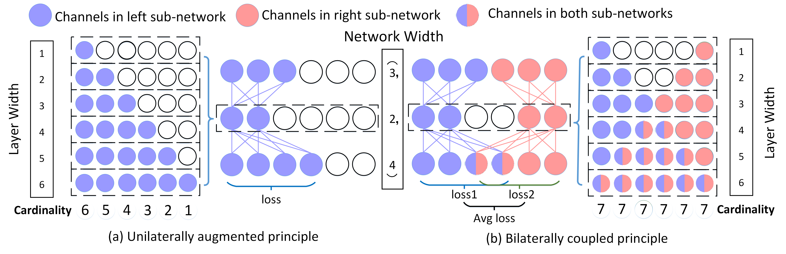
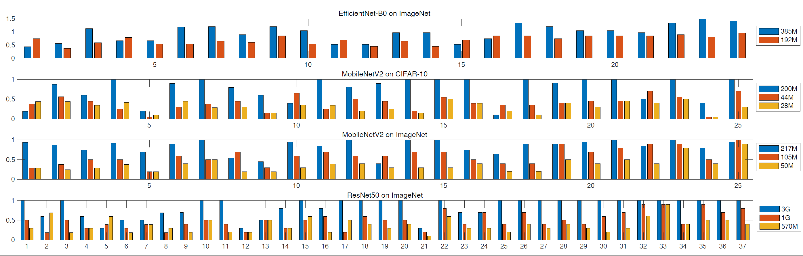

# BCNet: Searching for Network Width with Bilaterally Coupled Network
This repository includes the code for [BCNet: Searching for Network Width with Bilaterally Coupled Network](https://openaccess.thecvf.com/content/CVPR2021/papers/Su_BCNet_Searching_for_Network_Width_With_Bilaterally_Coupled_Network_CVPR_2021_paper.pdf). 
BCNet aims to search with neural architectures in more fairly way,

## Dependencies

The virtual env should be activated first:
```shell
source pt0.4.1 # or source sample/source.sh
easy_install --user backends/cellular-0.1-py3.7.egg #install cellular
pip install astor --user # required for quantization function.
pip install pthflops --user
```

* pymoo==0.3.0  
```
pip install pymoo==0.3.0 --user
```

## BCNet
BCNet is a channel number search (neural architecture search) method that aims to boost the fairly training of supernet. With BCNet,
 all Supernet channels (weights) can be trained at the same time. As a result, BCNet can help supernet more accurately rank
  all architectures. 
  
BCNet is a plug-and-play method and can be easily used within other channel number search or neural architecture search algorithms.
From our experience, you can boost your search result by 1% on Top-1 accuracy with ImageNet dataset using BCNet in other NAS methods.
If you have any questions, please comment with an issue.

 

For someone who only wants to leverage the useful architectures searched with BCNet, you can refer to ''[temp/search_results.xlsx](https://github.com/xiusu/BCNetV2/blob/main/BCNet/temp/search_results.xlsx)''
 for the recorded architectures. Please note that for skipping layers or depthwise related layers, we merge the layers which are 
 required to have the same output dimensions.



## Usage  
```
sh sample/run.sh partition num_gpu

Before running this code, you need to change the json_path in yaml according to your own data path.

For example, MobileNet50 with 50% FLOPs in ImageNet dataset:
sh sample/run.sh 3dv-share 8 config/retrain/config_mbv2_imgnet_fairnet_20list_0.5.yaml

For ResNet50 with 50% FLOPs in ImageNet dataset:
sh sample/run.sh 3dv-share 8 config/retrain/config_resnet50_imgnet_fairnet_20list_0.5.yaml

For VGG-19 with 50% FLOPs in Cifar-10 dataset:
sh sample/run.sh 3dv-share 8 config/retrain/config_VGG19_fairnet_20list_0.5.yaml

where 10/20 list means the total channels been divided into 10/20 parts.

```

##BCNetV2

We have provided the upgraded version of BCNet, named [BCNetV2](https://arxiv.org/pdf/2203.13714.pdf). 
In BCNetV2, we follow all basic settings as in BCNet and provide a choice for the setting of the smallest channel group to reduce the search space. However, this setting will destroy the 
fair training (all channels get the same number of training) of supernet. Thus we provide BCNetV2 as the enhanced supernet to ensure rigorous training fairness over channels. The search results can be
largely boosted with the proposed BCNetV2 from BCNet.
The code of [BCNetV2] is provided in [here](https://github.com/xiusu/BCNetV2/tree/main/BCNetV2).

## Citation
If you find BCNet and BCNetV2 interesting and help your work, please consider citing them:

```
@article{bcnetv2,
  title={Searching for Network Width with Bilaterally Coupled Network},
  author={Su, Xiu and You, Shan and Xie, Jiyang and Wang, Fei and Qian, Chen and Zhang, Changshui and Xu, Chang},
  journal={arXiv preprint arXiv:2203.13714},
  year={2022}
}

@inproceedings{bcnet,
  title={BCNet: Searching for Network Width with Bilaterally Coupled Network},
  author={Su, Xiu and You, Shan and Wang, Fei and Qian, Chen and Zhang, Changshui and Xu, Chang},
  booktitle={Proceedings of the IEEE/CVF Conference on Computer Vision and Pattern Recognition},
  pages={2175--2184},
  year={2021}
}
```