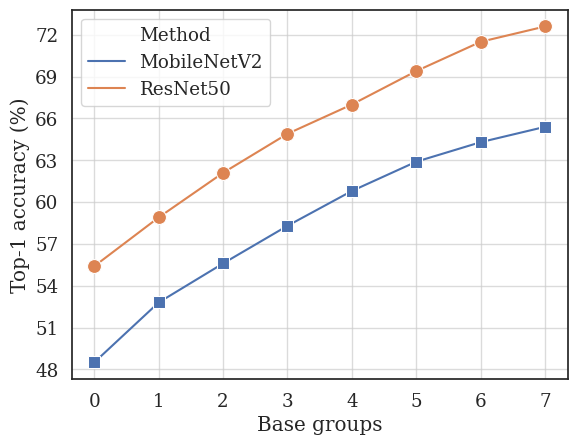

# BCNetV2: Searching for Network Width with Bilaterally Coupled Network
This repository includes the code for [BCNetV2: Searching for Network Width with Bilaterally Coupled Network](https://arxiv.org/pdf/2203.13714.pdf). 
BCNetV2 aims to search with neural architectures with more fairly way, BCNetV2 is an improved version for BCNet([paper](https://arxiv.org/pdf/2203.13714.pdf), [code](XXXX)). We follow almost all settings of 
BCNet and boost the search of supernet but standardized code.

## Dependences

The virtual env should be activated first:
```shell
pytorch >= 1.3.1
easy_install --user backends/cellular-0.1-py3.7.egg #install cellular
pip install astor --user # required for quantization function.
pip install pthflops --user
```

* pymoo==0.3.0  
```
pip install pymoo==0.3.0 --user
```

## BCNetV2
BCNetV2 is a channel number search (neural architecture search) method that aims to boost the fairly training of supernet. With BCNetV2,
we can boost the search result with two ways.  

(1) BCNetV2 can boost the training fairness of supernet. With BCNetV2, all channels can be equally trained with the same training times. 
Therefore, BCNetV2 can be more effective for ranking different architectures.

 

(2) We propose to search with a pre-defined smallest channel groups, since a small dimension in one layer will destroy the performance of 
an architecture. With a pre-defined smallest channel groups, the search space can be reduced by exponentially and thus boost the search results.
 
 
 
 
BCNetV2 is a plug and play method and can be easily used within other channel number search or neural architecture search algorithms.
From our experience, you can boost your search result with our BCNetV2 in other NAS methods.


## Channel-Bench-Macro
We propose a new [Channel-Bench-Macro](https://github.com/xiusu/Channel-Bench-Macro) benchmark for evaluating the performance of all channel number search algorithms. 
Channel-Bench-Macro is a channel benchmark on macro search space. The Channel-Bench-Macro consists of 16384 X 2 networks for MobileNet and ResNet search space. We provide the test accuracies,
 parameters, FLOPs, and training logs on CIFAR-10 dataset. Channel-Bench-Macro is the corresponding benchmark of [NAS-Bench-Marco](https://github.com/xiusu/NAS-Bench-Macro),
  which serves for channel number search / channel pruning algorithms.

All the evaluated architectures are stored in [Channel-Bench-Macro](https://github.com/xiusu/Channel-Bench-Macro) of file `nas-bench-macro_cifar10.json` with the following format:

```
{
    arch1: {
        test_acc: [float, float, float], // the test accuracies of three independent training
        mean_acc: float, // mean accuracy
        std: float, // the standard deviation of test accuracies
        params: int, // parameters
        flops: int, // FLOPs 
    },
    arch2: ......
}
```


## Reproducing

We separate the search and retrain for NAS. For searching useful architectures:
```
PYTHONPATH=../../:$PYTHONPATH  sh tools/slurm_train.sh VA 4 con-fig/strategies/NAS/bcnet_supernet_4cards.yaml nas_pruning_model config/models/MobileNetV2/MobileNetV2_1.5x_min6.yaml --edgenn-config config/edgenn/pruning/bcnet_train_search_bin20_min6_305M.yaml
```

For retraining of searched architectures:
```
PYTHON-PATH=../../:$PYTHONPATH sh tools/slurm_train.sh VA 8 config/strategies/mbv2_se.yaml nas_pruning_model config/retrain/BCNet_mbv2_comp_150M_retrain_test.yaml
```

## Citation
If you find that BCNet interesting and help your work, please consider citing it:

```
@article{bcnetv2,
  title={Searching for Network Width with Bilaterally Coupled Network},
  author={Su, Xiu and You, Shan and Xie, Jiyang and Wang, Fei and Qian, Chen and Zhang, Changshui and Xu, Chang},
  journal={arXiv preprint arXiv:2203.13714},
  year={2022}
}

@inproceedings{bcnet,
  title={BCNet: Searching for Network Width with Bilaterally Coupled Network},
  author={Su, Xiu and You, Shan and Wang, Fei and Qian, Chen and Zhang, Changshui and Xu, Chang},
  booktitle={Proceedings of the IEEE/CVF Conference on Computer Vision and Pattern Recognition},
  pages={2175--2184},
  year={2021}
}
```
